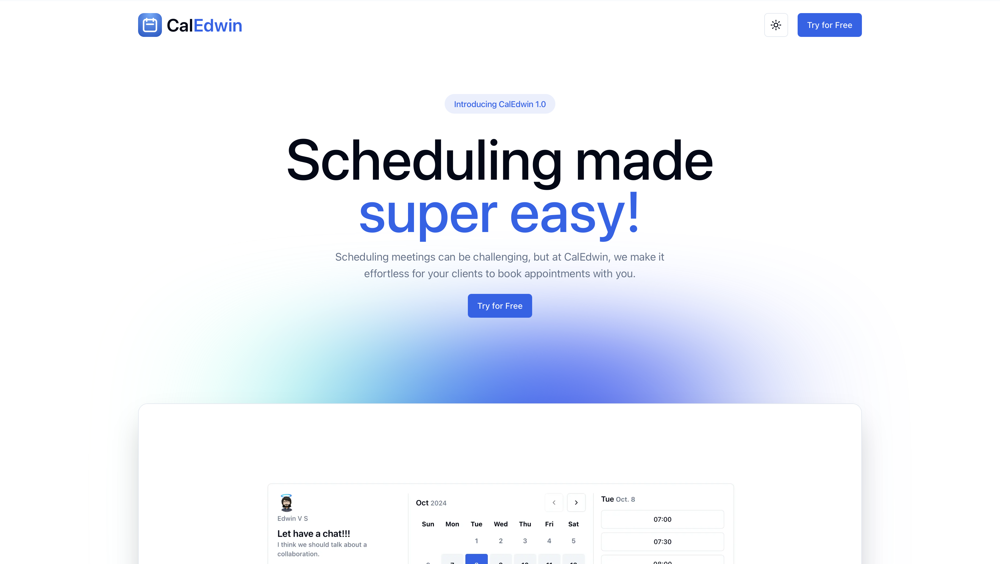

# CalEdwin

<p><samp>CalEdwin is a calendar scheduling platform which is an intuitive tool designed to streamline the process of scheduling meetings and events. With features like real-time availability sharing, automated reminders, and seamless integration with popular calendars, users can effortlessly coordinate with others, eliminate scheduling conflicts, and enhance productivity. Whether for personal use or team collaboration, this platform simplifies time management, making planning more efficient and stress-free.</samp></p>

#
### Author
Edwin | [@edwiee](https://github.com/edwiee)

#
### Tech Stack
[NextJS](https://nextjs.org) &nbsp; [AuthJS](https://authjs.dev) &nbsp; [Nylas](https://www.nylas.com) &nbsp; [Tailwind CSS](https://tailwindcss.com)


#


[Live Demo](https://caledwin.vercel.app)

## Setup locally

Make sure to install the dependencies:

```bash
# yarn
yarn install

# npm
npm install

# pnpm
pnpm install --shamefully-hoist
```

## Development Server

Start the development server on http://localhost:3000

```bash
npm run dev
```

## Production

Build the application for production:

```bash
npm run build
```

Locally preview production build:

```bash
npm run preview
```

----
<p align = "center"><samp>Made with ❤️ - <a href = "https://github.com/edwiee">edwiee</a></samp></p>
